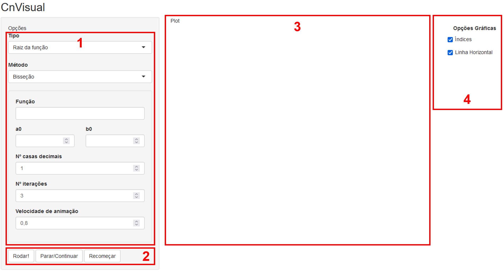
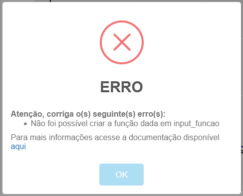
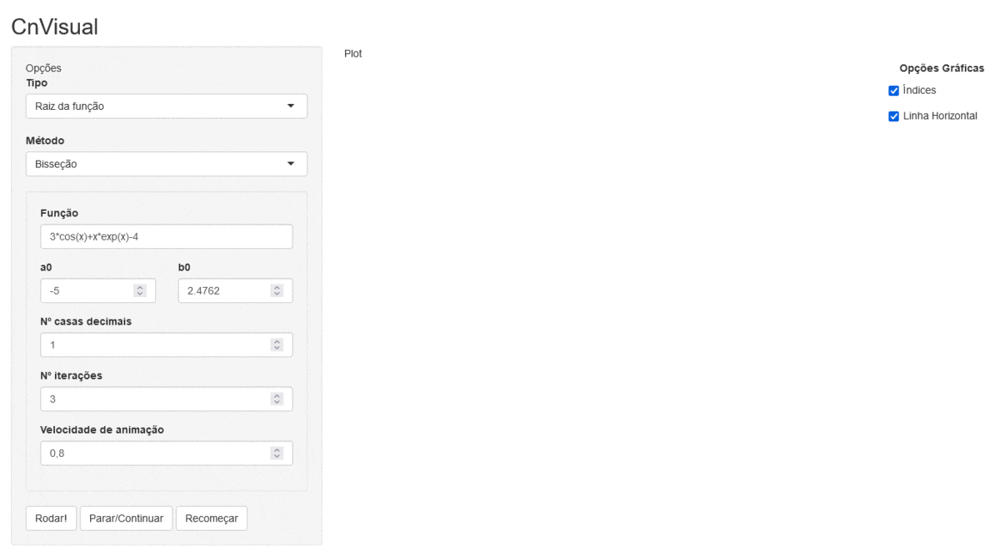
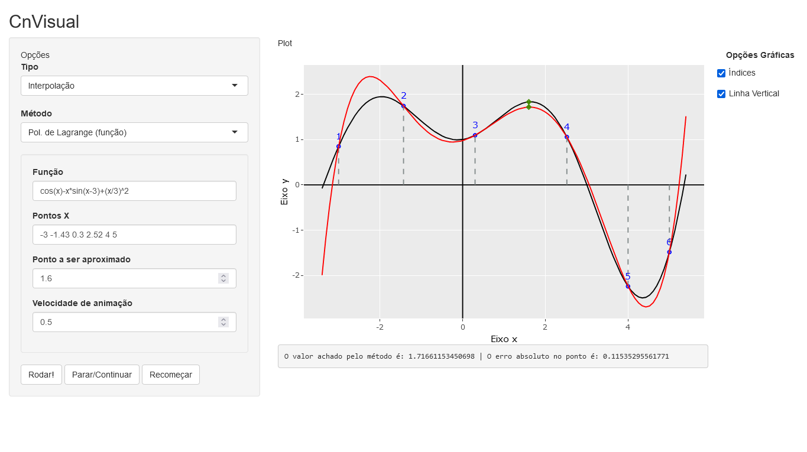
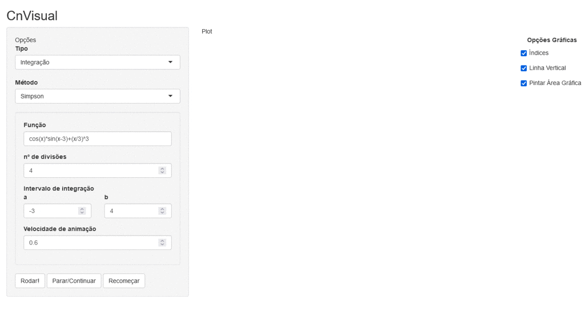

::: {#buttons .over_page}
<a href="https://vvieira.shinyapps.io/cnvisual_shiny/" class="link_button">
        CnVisual
</a>
:::

Bem-vindo(a) a página de documentação do [CnVisual](https://vvieira.shinyapps.io/cnvisual_shiny/), uma ferramenta computacional desenvolvida utilizando a linguagem de programação [R](https://www.r-project.org/) e suas bibliotecas, em especial o [Shiny](https://shiny.rstudio.com/).

Através dessa página você terá acesso a exemplos de como usar a ferramenta e algumas outras informações úteis. Em caso de dúvidas/sugestões, não hesite em entrar em contato conosco através [desse link][link_contato].

------

## A Ferramenta {#Ferramenta}

O intuito do CnVisual é auxiliar na aprendizagem e ensino do Cálculo Numérico. Embora os valores encontrados pelos métodos sejam dados ao usuário, é importante ter em mente que o foco deve ser na exposição das iterações através dos *plots* e as animações.

Foi implementado um total de 9 métodos, que estão divididos em 3 categorias:

  - [Métodos de aproximação de raízes de funções](#Raizes);
  - [Métodos de interpolação de pontos](#Interpolacao);
  - [Métodos de aproximação de integração de funções](#Integracao).

Os tipos e métodos que serão utilizados podem ser selecionados através dos campos "Tipo" e "Método" na coluna "Opções". Cada método tem uma abordagem diferente, que pode ser melhor compreendida através das animações do CnVisual.

Abaixo estão especificados quais são esses métodos e seus valores de entrada para pleno da ferramenta. Além disso, são colocados *links* que direcionam para algumas páginas da *web* que tem o intuito de auxiliar no entendimento dos métodos. Não necessariamente a nomenclatura dessas páginas é a mesma utilizada aqui, tendo em vista que usamos como referência bibliográfica o livro [Ruggiero 2ª Ed.][link_ruggiero].

**Você pode ir diretamente para a parte de exemplos clicando [aqui](#Exemplos).**

------

### Aproximação de Raízes {#Raizes .tabset}

Nesta categoria estão os métodos que conseguem aproximar as raízes de uma dada função.

#### Bisseção

Esse método divide intervalos ao meio repetidamente de forma que a cada iteração fique cada vez menor e contenha uma raiz.\
Para mais informações: [Wikipedia](https://pt.wikipedia.org/wiki/Método_da_bisseção) ou [Ruggiero 2ª Ed.][link_ruggiero] Cap. 2.3.2.I

|Campo|Valor esperado|Exemplo|Significado|
|:---:|:---:|:---:|:---:|
|Função|Expressão matemática em função de ***x*** (minúsculo) e usando a [sintaxe do R][link_sintaxe_R]| `4*cos(x) - sin(x)^2 + exp(3) + sqrt(x)`|Função que será aproximada pelo método|
|a0|Número real com ponto **"."** como separador decimal|`-2.4543`|Limite inferior do intervalo a0<b0|
|b0|Número real com ponto **"."** como separador decimal|`5`|Limite superior do intervalo a0<b0|
|Nº casas decimais|Número inteiro positivo|`2`|Número de casas decimais aceitável para interromper as iterações. 2 equivale a 0.01, 3 a 0.001...|
|Nº Iterações|Número inteiro positivo|`7`|Quantidade máxima de iterações para interromper o método|
|Velocidade de animação|Número real positivo com ponto **"."** como separador decimal|`1.2`|Tempo em segundos entre cada *step* do *plot*|

#### Posição Falsa

Esse método é similar ao método da Bisseção de forma que a cada iteração se tem um intervalo menor e contendo uma raiz. Porém, ao invés de utilizar o ponto médio do intervalo, utiliza a secante, garantindo que a cada iteração o intervalo será menor e tem uma raiz presente.\
Para mais informações: [Wikipedia](https://pt.wikipedia.org/wiki/Método_da_posição_falsa) ou [Ruggiero 2ª Ed.][link_ruggiero] Cap. 2.3.2.II

|Campo|Valor esperado|Exemplo|Significado|
|:---:|:---:|:---:|:---:|
|Função|Expressão matemática em função de ***x*** (minúsculo) e usando a [sintaxe do R][link_sintaxe_R]|`4*cos(x) - sin(x)^2 + exp(3) + sqrt(x)`|Função que será aproximada pelo método|
|a0|Número real com ponto **"."** como separador decimal|`-2.4543`|Limite inferior do intervalo a0<b0|
|b0|Número real com ponto **"."** como separador decimal|`5`|Limite superior do intervalo a0<b0|
|Nº casas decimais|Número inteiro positivo|`2`|Número de casas decimais aceitável para interromper as iterações, 2 equivale a 0.01, 3 a 0.001...|
|Nº Iterações|Número inteiro positivo|`7`|Quantidade máxima de iterações para interromper o método|
|Velocidade de animação|Número real positivo com ponto **"."** como separador decimal|`1.2`|Tempo em segundos entre cada step do *plot*|

#### Newton-Raphson

Nesse método é utilizado um ponto inicial, calculada a reta tangente desse ponto, no ponto em que essa reta cruza o eixo das abscissas é reiniciado o ciclo de forma iterativa.\
Para mais informações: [Wikipedia](https://pt.wikipedia.org/wiki/Método_de_Newton–Raphson) ou [Ruggiero 2ª Ed.][link_ruggiero] Cap. 2.3.2.IV

|Campo|Valor esperado|Exemplo|Significado|
|:---:|:---:|:---:|:---:|
|Função|Expressão matemática em função de ***x*** (minúsculo) e usando a [sintaxe do R][link_sintaxe_R]|`4*cos(x) - sin(x)^2 + exp(3) + sqrt(x)`|Função que será aproximada pelo método|
|x0|Número real com ponto **"."** como separador decimal|`-2.4543`|Primeiro ponto utilizado pelo método|
|Nº casas decimais|Número inteiro positivo|`2`|Número de casas decimais aceitável para interromper as iterações, 2 equivale a 0.01, 3 a 0.001...|
|Nº Iterações|Número inteiro positivo|`7`|Quantidade máxima de iterações para interromper o método|
|Velocidade de animação|Número real positivo com ponto **"."** como separador decimal|`1.2`|Tempo em segundos entre cada step do *plot*|

#### Secantes

Esse método é bastante similar ao método da posição falsa, porém, não é necessário que tenha uma raiz entre os pontos utilizados para calcular a secante.\
Para mais informações: [Wikipedia](https://pt.wikipedia.org/wiki/Método_das_secantes) ou [Ruggiero 2ª Ed.][link_ruggiero] Cap. 2.3.2.V

|Campo|Valor esperado|Exemplo|Significado|
|:---:|:---:|:---:|:---:|
|Função|Expressão matemática em função de ***x*** (minúsculo) e usando a [sintaxe do R][link_sintaxe_R]|`4*cos(x) - sin(x)^2 + exp(3) + sqrt(x)`|Função que será aproximada pelo método|
|x0|Número real com ponto **"."** como separador decimal|`-2.4543`|Primeiro ponto utilizado pelo método para calcular a secante|
|x1|Número real com ponto **"."** como separador decimal|`-2.4543`|Segundo ponto utilizado pelo método para calcular a secante|
|Nº casas decimais|Número inteiro positivo|`2`|Número de casas decimais aceitável para interromper as iterações, 2 equivale a 0.01, 3 a 0.001...|
|Nº Iterações|Número inteiro positivo|`7`|Quantidade máxima de iterações para interromper o método|
|Velocidade de animação|Número real positivo com ponto **"."** como separador decimal|`1.2`|Tempo em segundos entre cada step do *plot*|

------

### Interpolação {#Interpolacao .tabset}

Esses métodos utilizam de ponto(s) para interpolar uma função. Sendo bastante útil para aproximações de uma função contínua para valores discretos.

#### Polinômio por função

Esse método utiliza Polinômio de Lagrange para interpolar uma função que passe por todos os pontos dados pelo usuário. Esse caso em que são dadas a função e as coordenadas dos pontos no Eixo X é útil para aproximar um ponto da função usando um polinômio e compará-los.\
Para mais informações: [Wikipedia](https://pt.wikipedia.org/wiki/Polinômio_de_Lagrange) ou [Ruggiero 2ª Ed. Cap 5.3.2][link_ruggiero]

|Campo|Valor esperado|Exemplo|Significado|
|:---:|:---:|:---:|:---:|
|Função|Expressão matemática em função de ***x*** (minúsculo) e usando a [sintaxe do R][link_sintaxe_R]|`4*cos(x) - sin(x)^2 + exp(3) + sqrt(x)`|Função que será aproximada pelo método|
|Pontos X|Números reais com ponto **"."** como separador decimal, separados por espaço **" "**|`-3 -1.432 0.53 2 3.1`|Coordenada no Eixo X dos pontos utilizados para fazer a interpolação|
|Ponto a ser aproximado|Número real com ponto **"."** como separador decimal|`-2.4543`|Com o polinômio gerado, é aproximado o valor desse ponto e comparado com o valor do mesmo na função|
|Velocidade de animação|Número real positivo com ponto **"."** como separador decimal|`1.2`|Tempo em segundos entre cada step do *plot*|

#### Polinômio por pontos

Esse método é o mesmo do polinômio por função, porém, ao invés de utilizar a função são utilizadas as coordenadas dos pontos no Eixo Y.\
Para mais informações: [Wikipedia](https://pt.wikipedia.org/wiki/Polinômio_de_Lagrange) ou [Ruggiero 2ª Ed. Cap 5.3.2][link_ruggiero]

|Campo|Valor esperado|Exemplo|Significado|
|:---:|:---:|:---:|:---:|
|Pontos X|Números reais com ponto **"."** como separador decimal, separados por espaço **" "**|`-3 -1.432 0.53 2 3.1`|Valor no Eixo X dos pontos utilizado para fazer a interpolação|
|Pontos Y|Números reais com ponto **"."** como separador decimal, separados por espaço **" "**|`-3 -1.432 0.53 2 3.1`|Valor no Eixo Y dos pontos utilizado para fazer a interpolação|
|Ponto a ser aproximado|Número real com ponto **"."** como separador decimal|`-2.4543`|Com o polinômio gerado, é aproximado o valor desse ponto|
|Velocidade de animação|Número real positivo com ponto **"."** como separador decimal|`1.2`|Tempo em segundos entre cada step do *plot*|

#### Taylor

Esse método utiliza a série de Taylor para aproximar polinômios de diferentes graus e dessa forma poder aproximar um ponto da redondeza.\
Para mais informações: [Wikipedia](https://pt.wikipedia.org/wiki/https://pt.wikipedia.org/wiki/Série_de_Taylor)

|Campo|Valor esperado|Exemplo|Significado|
|:---:|:---:|:---:|:---:|
|Função|Expressão matemática em função de ***x*** (minúsculo) e usando a [sintaxe do R][link_sintaxe_R]|`4*cos(x) - sin(x)^2 + exp(3) + sqrt(x)`|Função que será aproximada pelo método|
|Ponto utilizado pelo método|Número real com ponto **"."** como separador decimal|`-2.4543`|Ponto utilizado para aproximar os polinômios por Taylor|
|Ponto a ser aproximado|Número real com ponto **"."** como separador decimal|`-2.4543`||
|Graus de integração|Seleção no box (Verdadeiro ou Falso)|`[ ] Grau 1` `[X] Grau 2` `[X] Grau 3` `[ ] Grau 4` `[X] Grau 5` |Grau das funções que serão aproximadas no entorno do ponto aproximado|
|Velocidade de animação|Número real positivo com ponto **"."** como separador decimal|`1.2`|Tempo em segundos entre cada step do *plot*|

------

### Integração {#Integracao .tabset}

Esses métodos são utilizados para aproximar a integral definida da função utilizada. Dada a natureza da operação de integração, se torna um meio eficiente de simplificar problemas complexos.

#### Trapézios

Esse método divide o intervalo de integração dado em subintervalos, são traçadas retas entre as extremidades desses subintervalos e calculada a área dos trapézios formados.\
Mais informações: [Wikipedia](https://pt.wikipedia.org/wiki/Integração_numérica) ou [Ruggiero Cap. 7.2.2][link_ruggiero]

|Campo|Valor esperado|Exemplo|Significado|
|:---:|:---:|:---:|:---:|
|Função|Expressão matemática em função de ***x*** (minúsculo) e usando a [sintaxe do R][link_sintaxe_R]|`4*cos(x) - sin(x)^2 + exp(3) + sqrt(x)`|Função que terá o valor da integral aproximado pelo método|
|nº de divisões|Número inteiro positivo|`2`|Quantidade de sub-intervalos que o intervalo será dividido|
|Intervalo de Integração|Dois números reais com **"."** como separador decimal|a = `-2.4` b = `3.7`|Intervalo de integração que será aproximado pelo método|
|Velocidade de animação|Número real positivo com ponto **"."** como separador decimal|`1.2`|Tempo em segundos entre cada step do *plot*|

#### Simpson

Esse método é similar ao dos trapézios repetidos, porém, ao invés de traçar a reta que passa pela extremidade dos subintervalos, traçadas funções de segundo grau que passam por 3 pontos da função e calculada sua área.\
Mais informações: [Wikipedia](https://pt.wikipedia.org/wiki/Fórmula_de_Simpson) ou [Ruggiero Cap. 7.2.4][link_ruggiero]

|Campo|Valor esperado|Exemplo|Significado|
|:---:|:---:|:---:|:---:|
|Função|Expressão matemática em função de ***x*** (minúsculo) e usando a [sintaxe do R][link_sintaxe_R]|`4*cos(x) - sin(x)^2 + exp(3) + sqrt(x)`|Função que terá o valor da integral aproximado pelo método|
|nº de divisões|Número inteiro positivo e par|`4`| Quantidade de sub-intervalos que o intervalo será dividido|
|Intervalo de Integração|Dois números reais com **"."** como separador decimal|a = `-2.4` b = `3.7`|Intervalo de integração que será aproximado pelo método|
|Velocidade de animação|Número real com ponto **"."** como separador decimal|`1.2`|Tempo em segundos entre cada step do *plot*|

-----

## Interface

Além dos seletores de métodos e seus respectivos parâmetros de entrada, a interface conta com outras áreas.

{.print}

Na área 1 estão os *inputs* conforme já explicado na seção anterior. Os botões da Área 2 servem para rodar o método e controlar a animação mostrada na área 3. Além da animação, na área 3 estão também são mostrados os resultados mostrados pelo método e alertas, caso necessário. Já na Área 4 estão presentes algumas opções gráficas, que controlam o plot.

### Janela de erro e avisos

Talvez você se depare com a janela de erro, similar a figura abaixo. Boa parte dos erros estão mapeados e terá uma breve descrição do que ocorreu, mas de forma geral, quando os erros são entradas inválidas, como, por exemplo, virgula **","** no lugar de ponto **"."** como separador decimal. Confira a seção de [parâmetros](#Ferramenta) acima.\

Também pode ocorrer um erro devido à natureza do método, por exemplo: divisão por zero ao longo de alguma das iterações.\

{width=425px .print}

Caso você encontre algum erro não mapeado `"Erro desconhecido"` ou tenha dúvidas quanto a natureza de algum outro erro, [entre em contato conosco][link_contato].

## Exemplos {#Exemplos .tabset}

Aqui estão presentes alguns *prints* com exemplos de uso da ferramenta:

### Exemplo 1
{.print}

### Exemplo 2
{.print}

### Exemplo 3
{.print}

[link_contato]:https://forms.gle/7ScdnoWzJTUMcECG9
[link_ruggiero]:https://bit.ly/3BxI31V
[link_sintaxe_R]:https://www.tutorialgateway.org/r-arithmetic-operators/

